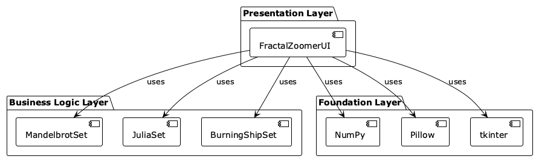
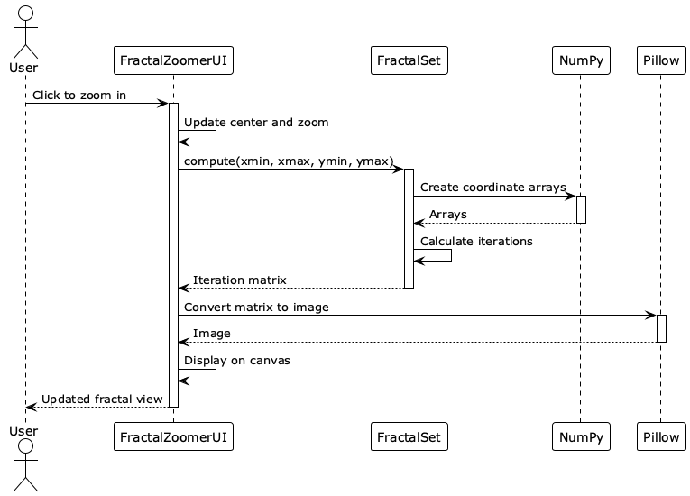
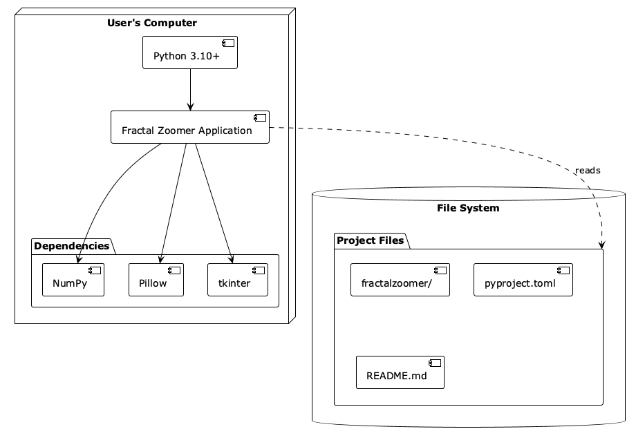

# Design

## Architecture

We kept it simple with three layers:

**UI Layer (top)**
- `FractalZoomerUI` - handles the tkinter window, mouse clicks, and rendering

**Logic Layer (middle)**  
- `MandelbrotSet`, `JuliaSet`, `BurningShipSet` - each one knows how to compute its fractal

**Foundation (bottom)**
- NumPy for fast math
- Pillow for making images
- tkinter for the GUI

## Main Classes

### FractalZoomerUI

This is the main app window. It manages:
- The canvas where fractals appear
- Current zoom level and position
- Mouse events (clicks and drags)
- Switching between fractals

Key methods:
- `render()` - calculates and shows the current view
- `zoom_in()` / `zoom_out()` - handle zooming
- `on_drag()` - pans the view when you Ctrl+drag

### FractalSet (base class)

Abstract class that defines how fractals should work. Each specific fractal inherits from this.

Has:
- `width`, `height` - image size
- `max_iter` - how many iterations to try
- `compute()` - the fractal algorithm (different for each type)

### Mandelbrot, Julia, BurningShip

Each implements `compute()` with its specific formula:
- **Mandelbrot**: z = z² + c
- **Julia**: Same formula but with a fixed c value (-0.4 + 0.6i)
- **Burning Ship**: Like Mandelbrot but takes absolute values first

## How interactions work

When you click to zoom in:

1. You click on the canvas
2. UI calculates the new center and zoom level
3. Calls the fractal's `compute()` method
4. NumPy crunches through all the pixels
5. Returns an array of iteration counts
6. Pillow maps those to colors and creates an image
7. Image appears on the canvas

For panning (Ctrl+drag), it just updates the center coordinates based on how far you dragged.

## Where it runs

Just on your local computer - no servers involved. 

**Requirements:**
- Python 3.11+
- Works on Windows, Mac, or Linux
- NumPy and Pillow installed (Poetry handles this)

## Design patterns we used

**Strategy pattern**: The different fractal types are interchangeable strategies

**Template method**: The base FractalSet class defines the flow, subclasses fill in the algorithm

**MVC-ish**: FractalSet = Model, Canvas = View, FractalZoomerUI = Controller

## Performance notes

We use NumPy's vectorized operations everywhere instead of Python loops - this makes it way faster. The default 100 iterations gives good detail while keeping it interactive.

Canvas is fixed at 800x600 to balance quality and speed.

## Adding new fractals

Want to add another fractal type? Just:
1. Create a new class inheriting from FractalSet
2. Implement the `compute()` method with your formula
3. Add it to the fractal switcher in the UI

