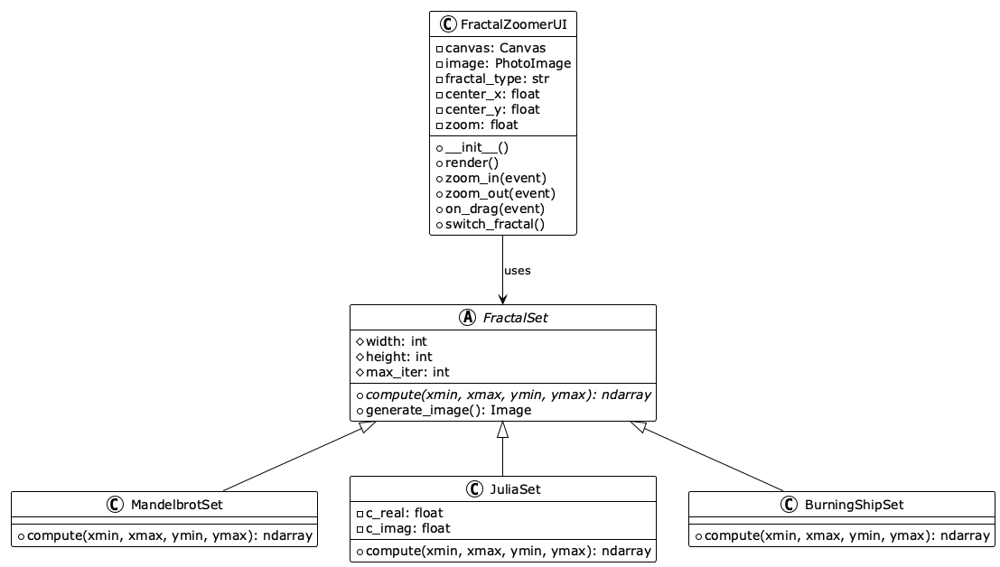

cd ~/Desktop/fractal-zoomer-project/report

# Download the properly formatted file
curl -o sections/03-design/design.md 'https://pastebin.com/raw/placeholder' 2>/dev/null || cat > sections/03-design/design.md << 'ENDOFFILE'
# Design

## Architecture Overview

The Fractal Zoomer application follows a three-tier layered architecture that separates concerns between presentation, business logic, and foundational utilities. This design promotes modularity, testability, and maintainability.

### Architectural Layers

**Presentation Layer**
- `FractalZoomerUI`: Manages the graphical user interface using tkinter
- Handles user input events (mouse clicks, drags, keyboard)
- Renders fractal images to the canvas
- Provides controls for fractal type selection

**Business Logic Layer**
- `MandelbrotSet`: Implements the Mandelbrot fractal algorithm
- `JuliaSet`: Implements the Julia set fractal algorithm
- `BurningShipSet`: Implements the Burning Ship fractal algorithm
- Each class encapsulates the mathematical computation for its respective fractal

**Foundation Layer**
- **NumPy**: Provides high-performance numerical array operations for coordinate calculations
- **Pillow**: Handles image generation and color mapping from iteration matrices
- **tkinter**: Provides the GUI framework for canvas rendering and user interaction

## Class Design

The application uses object-oriented design principles with inheritance and abstraction to create a flexible fractal rendering system.

### FractalZoomerUI

The main application class that manages the user interface and coordinates all interactions.

**Attributes:**
- `canvas`: tkinter Canvas widget for displaying fractals
- `image`: PhotoImage object holding the current rendered fractal
- `fractal_type`: String indicating current fractal ("mandelbrot", "julia", "burningship")
- `center_x`, `center_y`: Complex plane coordinates of the viewport center
- `zoom`: Current zoom level multiplier

**Methods:**
- `__init__()`: Initializes the window, canvas, and default fractal
- `render()`: Computes and displays the current fractal view
- `zoom_in(event)`: Zooms in centered on mouse click position
- `zoom_out(event)`: Zooms out centered on mouse click position
- `on_drag(event)`: Pans the view when user drags with Ctrl+click
- `switch_fractal()`: Cycles between available fractal types

### FractalSet (Abstract Base Class)

Defines the interface for all fractal computation classes.

**Attributes:**
- `width`: Image width in pixels
- `height`: Image height in pixels
- `max_iter`: Maximum iteration count for escape-time algorithm

**Methods:**
- `compute(xmin, xmax, ymin, ymax)`: Abstract method returning iteration count matrix
- `generate_image()`: Converts iteration matrix to colorized PIL Image

### MandelbrotSet

Implements the Mandelbrot set with the formula z = z^2 + c.

**Algorithm:**
- For each pixel coordinate c, iterate the formula
- Count iterations until magnitude exceeds 2 or max iterations reached
- Return iteration counts as a 2D NumPy array

### JuliaSet

Implements Julia sets with fixed constant c.

**Attributes:**
- `c_real`: Real part of the Julia constant
- `c_imag`: Imaginary part of the Julia constant

**Algorithm:**
- Uses fixed constant c = -0.4 + 0.6i
- For each pixel coordinate as z0, iterate the formula
- Return iteration counts

### BurningShipSet

Implements the Burning Ship fractal with absolute value operations.

**Algorithm:**
- Takes absolute values of real and imaginary components before squaring
- Produces distinctive ship-like structures in the rendered image

## Interaction Flow

The following sequence diagram illustrates the typical user interaction flow when zooming into a fractal.

### Zoom-In Workflow

1. User clicks on the canvas to zoom in
2. FractalZoomerUI receives the click event
3. Calculate new viewport: Updates center coordinates and increases zoom
4. Request computation: Calls fractal.compute() with new coordinate bounds
5. FractalSet creates coordinate arrays using NumPy
6. Compute iterations: Applies the escape-time algorithm vectorized over the grid
7. Return matrix: NumPy array of iteration counts
8. Generate image: Passes matrix to Pillow for color mapping
9. Render: Displays the new image on the tkinter canvas
10. User sees the zoomed fractal view

### Pan Workflow

When the user holds Ctrl and drags:
1. Mouse down event stores the starting position
2. Mouse move events calculate the delta
3. Center coordinates are adjusted by the delta scaled by zoom
4. Render is triggered on mouse release

## Deployment Architecture

The application runs as a standalone desktop application on the user's local machine.

### System Requirements

**Runtime Environment:**
- Python 3.10 or higher
- Operating System: Windows, macOS, or Linux with GUI support

**Dependencies:**
- NumPy: Scientific computing library for efficient array operations
- Pillow: Image processing library for fractal rendering
- tkinter: GUI library bundled with Python standard library

### Installation and Execution

The application is distributed as a Python package managed by Poetry. All dependencies are resolved and installed in an isolated virtual environment, ensuring consistent behavior across different systems.

## Design Patterns

### Strategy Pattern
The interchangeable fractal algorithms follow the Strategy pattern, allowing runtime selection of computation strategies through the abstract FractalSet interface.

### Template Method Pattern
The FractalSet base class provides a generate_image() template method that uses the abstract compute() method, defining the skeleton of the algorithm while letting subclasses customize specific steps.

### Model-View-Controller
- Model: FractalSet subclasses for data computation
- View: tkinter Canvas for rendering
- Controller: FractalZoomerUI for event handling and coordination

## Performance Considerations

### NumPy Vectorization
All fractal computations are fully vectorized using NumPy arrays, avoiding explicit Python loops. This provides significant performance improvements by leveraging optimized C implementations.

### Iteration Limits
The max_iter parameter balances visual detail with computation time. Default of 100 iterations provides good quality for typical zoom levels while maintaining interactive rendering speeds.

### Image Resolution
Fixed 800x600 resolution provides a balance between visual quality and computation speed. Higher resolutions would require proportionally more computation time.

## Extensibility

The architecture supports easy addition of new fractal types by creating a new class inheriting from FractalSet, implementing the compute() method with the fractal algorithm, and adding the fractal to the switch cycle in FractalZoomerUI.

