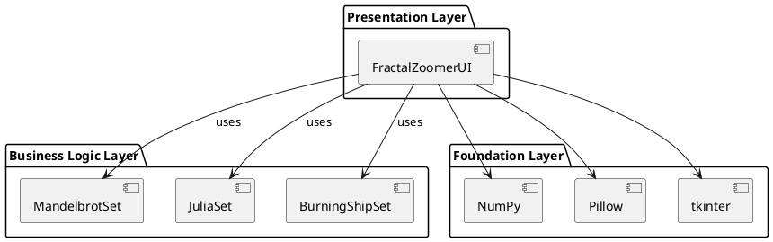
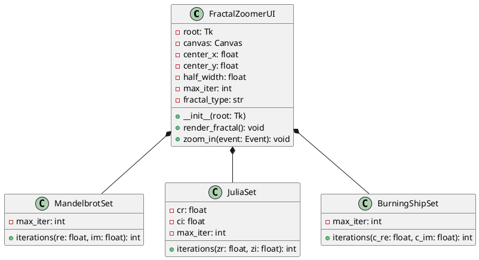
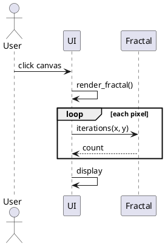
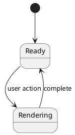

# Design

This chapter explains the design strategies used to meet the requirements identified in the analysis phase.

## Architecture

### Architectural Style: Layered Architecture

**Chosen Style:** Layered (N-tier) Architecture

**Why Layered?**
- Clear **separation of concerns** between UI and computation logic
- **Modular design** allows independent development and testing
- **Reusability** of fractal computation modules in other contexts
- **Maintainability** through isolated responsibilities

**Why Not Other Styles?**
- **Event-based**: Overkill for simple request-response interactions
- **Shared dataspace**: No need for persistent shared state
- **Service-oriented**: No distributed services needed
- **Microservices**: Single-machine application

### Component Diagram

### Component Responsibilities
**Presentation Layer (FractalZoomerUI)**
-Capture user input events
-Manage view state
-Coordinate fractal computations
-Render visual output

**Business Logic Layer (Fractal Classes)**
-Implement mathematical algorithms
-Calculate iteration counts
-Provide consistent interface

**Foundation Layer**
-NumPy: Numerical operations
-Pillow: Image creation
-tkinter: GUI framework

## Modelling
### Object-Oriented Design
#### Class Diagram

## Interaction
### Sequence Diagram: Zoom Interaction

## Behaviour
### State Diagram

## Performance
### Optimizations
-Quick Interior Tests (Mandelbrot): ~20% faster
-Integer Arithmetic: Grayscale mapping
-Simple Algorithms: Clear, adequate performance

### Current Limitations
Single-threaded

~2-3 seconds for 600×400 at 256 iterations
### Future Options
-Multiprocessing
-NumPy vectorization
-GPU acceleration

## Technology Justification
Python 3.8+: Rapid development, readable

-tkinter: Built-in, zero dependencies
-NumPy: Industry standard, optimized
-Pillow: Simple image creation
